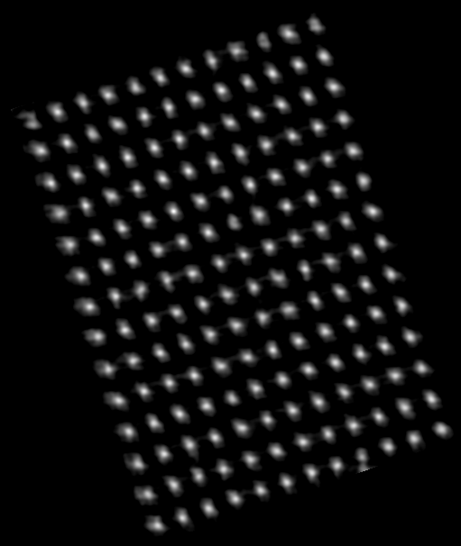
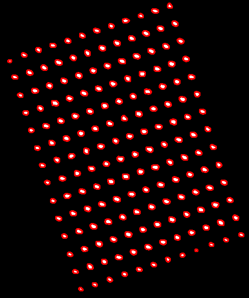
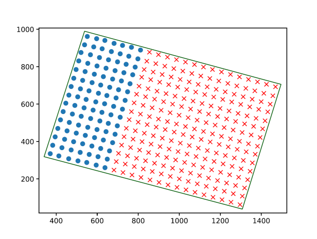

<!-- PROJECT LOGO -->

 
<h1 align="center">Aplicación de conteo de árboles y detección de patrones de cultivo</h1>

  

    Herramienta para detectar árboles, patrones de plantación, fallos entre árboles y obtener imágenes de cada árbol
    sobre una parcela utilizando imágenes por satélite de Google Maps o imágenes de gran
    resolución tomadas por drones.
     
      <a href="#vídeos-de-demostración">Ver demostración</a>
  

<!-- TABLE OF CONTENTS -->

<h3> Índice </h1>

- [Acerca del proyecto](#acerca-del-proyecto)
  * [Teconlogías utilizadas](#teconlogías-utilizadas)
- [Diseño del proyecto](#diseño-del-proyecto)
  * [Obtención de imágenes](#obtención-de-imágenes)
  * [Detección de árboles](#detección-de-árboles)
  * [Análisis de direcciones](#análisis-de-direcciones)
  * [Detección de fallos](#detección-de-fallos)
  * [Recorte de árboles](#recorte-de-árboles)
  * [Estimación de producción](#estimación-de-producción)
  * [Imágenes de gran resolución](#imágenes-de-gran-resolución)
- [Vídeos de demostración](#vídeos-de-demostración)

<!-- ABOUT THE PROJECT -->
## Acerca del proyecto

El objetivo del proyecto es el desarrollo de una aplicación que pueda obtener imágenes de Google Maps o de cualquier otra fuente
para detectar los árboles, analizar su patrón de plantación, obtener imágenes individuales de cada árbol y realizar estimaciones
de producción.

La aplicación implementa en la interfaz de usuario la integración de Google Maps para elegir la zona que se desea analizar. La
detección de los árboles se realiza mediante la técnica de búsqueda de patrones y se calibra el contorno de cada árbol detectado
obteniendo su posición en la imagen. Mediante las posiciones se analiza el patrón de plantación o direcciones principales 
con el objetivo de crear una estructura de árboles donde a cada árbol se le asigna sus árboles más próximos en cada dirección. 
Seguidamente, se detectan los fallos que se hayan podido generar en la estructura de árboles creada comprobando que cada árbol
presenta en cada dirección otro árbol próximo. Después se obtienen imágenes individuales de cada árbol detectado, se determina
un mismo tamaño para todas las imágenes y se rotan para que su dirección principal esté alineada con el eje de coordenadas.
Por último, con las imágenes de los árboles se puede realizar una estimación de producción mediante la interpolación lineal del 
tamaño de los árboles o mediante modelos de Deep Learning.

### Teconlogías utilizadas

* Python
* Numpy
* OpenCV
* Scikit-Learn
* Matplotlib
* Qt
* PyVips
* Geotiff
  

(<a href="#readme-top">Volver al inicio</a>)

<!-- DISEÑO DEL PROYECTO -->
## Diseño del proyecto

El funcionamiento del prototipo consta de varias fases donde en cada una de ellas se trata de resolver los requisitos planteados.
Se establece como objetivo que el proceso tenga flexibilidad de forma que no sea obligatorio ejecutar todas las fases, permitiendo
ejecutar hasta la fase que se desee.

  

### Obtención de imágenes 
Las imágenes se pueden abrir directamente desde el sistema de ficheros pero la aplicación también integra el módulo Qt WebEngine basado 
en Chromium para acceder a Google Maps en modo satélite que permite buscar la zona para analizar.

  

Para poder analizar la imagen es necesario definir la zona de árboles y marcar un árbol como plantilla para la detección.

  
  &nbsp; &nbsp; &nbsp; &nbsp;
  

(<a href="#readme-top">Volver al inicio</a>)

### Detección de árboles
Los árboles se detectan mediante la técnica de búsqueda de patrones (Template Matching) que se basa en buscar y encontrar la posición de
una imagen plantilla o patrón en otra imagen más grande. El método de detección consiste en combinar dos resultados de Template Matching
utilizando una imagen plantilla un árbol y otra con los árboles de alrededor.

  
  &nbsp; &nbsp; &nbsp; &nbsp;
  
  &nbsp; &nbsp; &nbsp; &nbsp;
  

  
  &nbsp; &nbsp; &nbsp; &nbsp;
  
  &nbsp; &nbsp; &nbsp; &nbsp;
  

Los resultados se combinan realizando la suma de ambos píxel a píxel y obtener una nueva imagen. El problema que se presenta para poder sumar 
las imágenes píxel a píxel es que cada una tiene distinto tamaño, concretamente (W-w+1, H-h+1) siendo (WxH) el tamaño de la imagen original 
y (wxh) el tamaño del patrón. Como ambos resultados utilizan un patrón de distinto tamaño, se necesita ajustar ambas imágenes para poder sumarlas
de manera adecuada. Se ha de realizar una transformación de traslación.

  
  &nbsp; &nbsp; &nbsp; &nbsp;
  
  &nbsp; &nbsp; &nbsp; &nbsp;
  

El siguiente paso es el filtrado de los valores de la imagen resultante con el objetivo de obtener los centros de los árboles. Debido a que el resultado
de Template Matching cada píxel tiene un valor entre 0 y 1 en función de la probabilidad, el objetivo es eliminar todos los píxeles cuyo valor sea menor 
que cierto umbral de probabilidad. Además se aplica un proceso de umbralización (Thresholding) para convertir los valores de los píxeles en 0 o 255.

  
  &nbsp; &nbsp; &nbsp; &nbsp;
  

Con la imagen umbralizada es sencillo aplicar la técnica de búsqueda de contornos con una función que crea un curva que une todos los píxeles continuos
que tienen el mismo color o intensidad. 

Obtenido cada contorno como un array de puntos, lo siguiente es obtener el centro de cada contorno. Para ello se utiliza el momento de la imagen, que es un promedio
ponderado particular de las intensidades de los píxeles de una imagen que permite calcular propiedades como el centro de masa, el área del objeto, etc. Lo que nos interesa
calcular es el centroide para cada contorno.

Finalmente, se aplican los centros obtenidos sobre la imagen original.

  
  &nbsp; &nbsp; &nbsp; &nbsp;
  

(<a href="#readme-top">Volver al inicio</a>)

### Análisis de direcciones
El objetivo es encontrar las direcciones principales y organizar los árboles en una estructura en la que cada uno tiene asignado sus árboles adyacentes. Ahora se trabaja
con las coordenadas de cada árbol sobre un sistema de coordenadas utilizando algebra lineal. Las direcciones se pueden calcular de distintas formas: manual, automática 
por mínima distancia o automática para distintas disntacias. Aquí solo se expondrá la forma automática por mínima distancia.

  

El objetivo es encontrar para cada árbol sus cuatro árboles más cercanos. El problema es parecido a la búsqueda del vecino más próximo (Nearest neighbor search), la posición 
de árboles adyacentes más cercanos nos indicarán cuáles son las direcciones principales de plantación de los árboles.

  

Para encontrar los cuatro puntos más próximos se utiliza un árbol kd, que devuelve para cada punto sus puntos más cercanos junto a sus distancias. Hay que tener en cuenta que
los puntos han de ser filtrados para descartar los puntos no válidos. Para ser más específicos, todos los puntos de los bordes tendrán un punto que no se corresponde con las 
direcciones y en las esquinas dos puntos serán dos.

  

Todos los puntos erróneos tienen en común que su distancia hacia el árbol es muy superior al resto de árboles. Se presume que se pueden eliminar estos puntos porque
tendrán una distancia mayor a un límite, utilizando el teorema de Pitágoras esta distancia se corresponde con la hipotenusa de un triángulo rectángulo.

  

Ahora se puede construir la estructura de árboles comprobando que para cada árbol sus vecinos encontrados no superan el límite de distancia calculado
por el teorema de Pitágoras. Con la estructura de árboles se pueden obtener las direcciones principales.

  

Las direcciones principales se obtienen mediante el análisis de grupos o clustering, se pretende agrupar puntos en grupos de forma que todos los puntos de un 
grupo se representen por un único punto. Se utlilizará el algoritmo DBSCAN.

El primer paso es obtener en qué dirección tiene cada árbol a sus vecinos encontrados. La forma de encontrar en qué dirección se encuentran los árboles adyacentes para
cada árbol es realizando una resta entre puntos, en concreto se resta cada punto adyacente con el punto central.

  

Con el algoritmo de agrupamiento DBSCAN se forman los grupos y se obtienen los centroides de cada grupo. Cada centroide será el que represente a cada dirección
principal.

  
  &nbsp; &nbsp; &nbsp; &nbsp;
  

(<a href="#readme-top">Volver al inicio</a>)

### Detección de fallos
En esta fase se analiza la estructura de árboles creada en la fase anterior y junto a las direcciones principales, se detectan los árboles fallidos en la estructura. Si un árbol debería
tener cuadro árboles adyacentes y solo tiene tres, entonces hay un árbol que falla y se busca en qué dirección se encuentra. También se comprueba que los árboles tienen sus
adyacentes en las direcciones principales para eliminar falsos positivos creados en la fase anterior. Un mismo fallo puede ser detectado por varios puntos, por lo que es
necesario registrar los fallos encontrados en una estructura de fallos, similar a la estructura de árboles, cada fallo tiene su posición y una lista con los puntos adyacentes (sean árboles o fallos).

  
  &nbsp; &nbsp; &nbsp; &nbsp;
  

De esta forma solo se pueden detectar los fallos adyacentes a los árboles.

  
  &nbsp; &nbsp; &nbsp; &nbsp;
  

De manera opcional, se puede solventar la limitación de la detección de fallos mediante la propagación de fallos en las direcciones principales. En la estructura de fallos, se comprueba para cada fallo
los fallos adyacentes a este en cada dirección y si en una o varias direcciones no se encuentra nada, entonces se crean fallos en los puntos de esas direcciones. Este proceso se realiza de manera
iterativa hasta que se ocupa toda la superficie marcada.

  
  &nbsp; &nbsp; &nbsp; &nbsp;
  

  
  &nbsp; &nbsp; &nbsp; &nbsp;
  

(<a href="#readme-top">Volver al inicio</a>)

### Recorte de árboles

Esta fase consiste en recortar y rotar cada árbol encontrado para obtener una imagen individual de cada uno. El ángulo de rotación será aquel donde la dirección
coincida con un eje. El propósito de obtener imágenes individuales de cada árbol es para ayudar a crear datasets para que puedan ser utilizados para entrenar redes neuronales.

El objetivo es calcular para cada árbol los puntos de dos cuadrados: interior y exterior. Los puntos de cuadrado exterior determinan el recorte sobre la imagen original
y los puntos del cuadrado interior determinan el recorte de la imagen rotada. El propósito de los cuadrados es realizar el recorte cuando no están rotados.

  
  &nbsp; &nbsp; &nbsp; &nbsp;
  

El cálculo del ángulo de rotación se realiza sobre una dirección principal elegida, pudiendo elegir entre rotar por la dirección horizontal o la dirección vertical positivas.
El valor es ángulo entre la dirección horizontal y el eje X o la dirección vertical y el eje Y. Este ángulo será común para todos los árboles y será el que
se utilice para crear la matriz de rotación.

  
  &nbsp; &nbsp; &nbsp; &nbsp;
  

El siguiente paso será determinar el tamaño del cuadrado interior, que se obtiene en función de la dirección principal elegida de rotación.

  

Para obtener el cuadrado exterior se utlizan los puntos del cuadrado interior tomando los máximos y mínimos de los puntos, para que todos los puntos del
cuadrado interior estén dentro de este.

  

Con los dos cuadrados ahora se pueden realizar los recortes. El primer recorte se aplica sobre la imagen original por los puntos del cuadrado exterior, sobre este recorte
se aplica la rotación a esta imagen con la matriz de rotación obtenida anteriormente. A continuación se realiza el segundo recorte con la imagen rotada sobre los puntos
del cuadrado interior.

  
  &nbsp; &nbsp; &nbsp; &nbsp;
  
  &nbsp; &nbsp; &nbsp; &nbsp;
  

  
  &nbsp; &nbsp; &nbsp; &nbsp;
  
  &nbsp; &nbsp; &nbsp; &nbsp;
  

(<a href="#readme-top">Volver al inicio</a>)

### Imágenes de gran resolución
Las imágenes de drones pueden tener resoluciones mayores a 15000×15000 y pesar varios gigabytes, además, puede que incluso no se puedan abrir debido a la falta de memoria en el sistema.

Las imágenes de gran resolución es necesario reducirlas, primero por su tamaño ocupado en memoria y segundo porque la reducción tiene un gran impacto en el tiempo de ejecución de las operaciones.

Aunque internamente la aplicación trabaje con la imagen reducida, en la fase de recorte de árboles el recorte del árbol debe realizarse en la imagen original. En esta fase se calculan los
puntos del cuadrado interior y exterior sobre la imagen reducida y a estos puntos se les aplica una transformación de escala para que sean puntos sobre la imagen original para poder hacer 
el recorte exterior, la rotación y el recorte interior.

  

  
  &nbsp; &nbsp; &nbsp; &nbsp;
  

(<a href="#readme-top">Volver al inicio</a>)

### Estimación de producción
La estimación se puede realizar de dos formas diferentes: simple o compleja. La estimación simple se utiliza para imágenes de baja resolución y la estimación compleja aplica un modelo
de Deep Learning previamente entrenado. Las estimaciones se realizan sobre un conjunto de imágenes que tengan todas el mismo tamaño, ya sea un conjunto propio o un conjunto creado
por la aplicación con la función de recorte de árboles.

El estimador simple se basa en aplicar una interpolación lineal sobre el color de las imágenes, se crea una máscara con los colores representativos de los árboles y se compara la cantidad
de color de cada imagen con la máscara para obtener el porcentaje de interpolación, a mayor porcentaje mayor la producción del árbol.

  
  &nbsp; &nbsp; &nbsp; &nbsp;
  

  

Para el estimador complejo se entrenaron cinco modelos de deep learning basados en redes neuronales convolucionales (CNN) utilizando imágenes RGB y multiespectrales de drones, para estimar 
la producción individual de cada árbol. Con resultados que mejoran un 30% las predicciones realizadas de los expertos humanos sobre los mismos cultivos. Se espera que en el futuro se mejoren
los resultados con mayores conjuntos de imágenes para aumentar la precisión de los modelos.

(<a href="#readme-top">Volver al inicio</a>)

## Vídeos de demostración

* <a href="https://youtu.be/26UkgcwchhQ">Video manejo básico</a>
* <a href="https://youtu.be/g77WeNiARH0">Video imágenes de gran resolución</a>
* <a href="https://youtu.be/L4-RTXagEVM">Video propagación de fallos</a>
* <a href="https://youtu.be/5fhnBk1wisE">Video ajuste de detección</a>

(<a href="#readme-top">Volver al inicio</a>)

